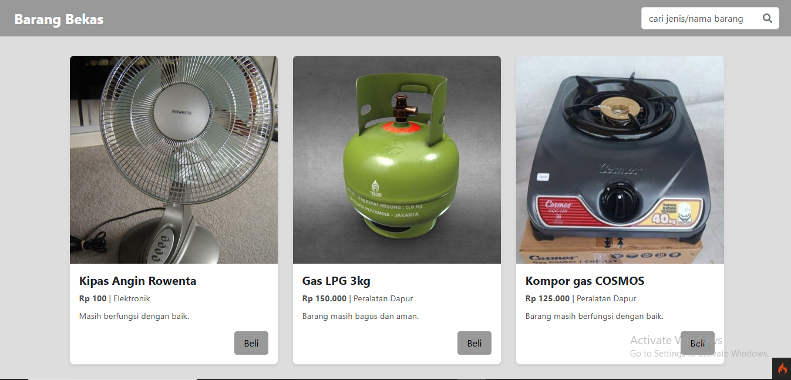
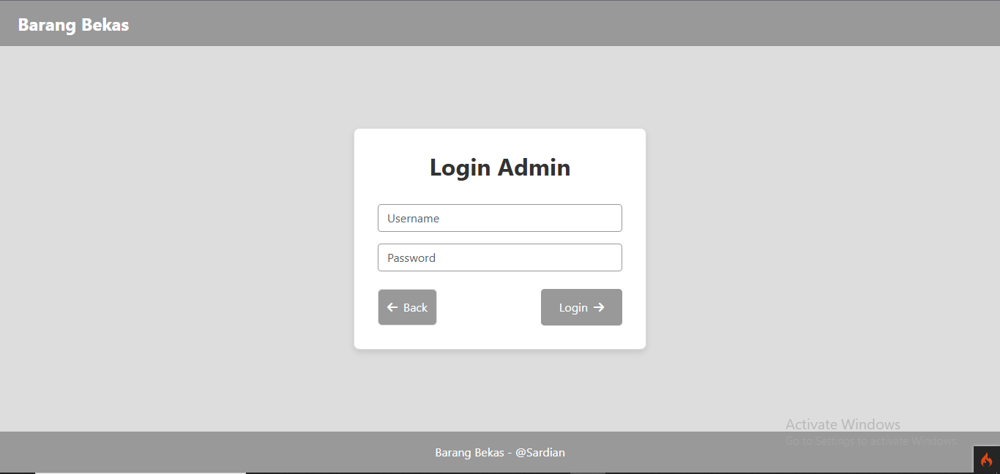
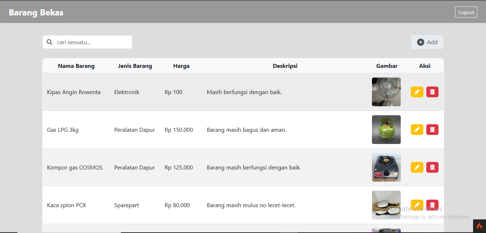
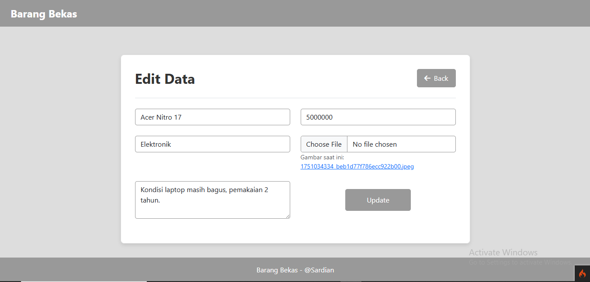
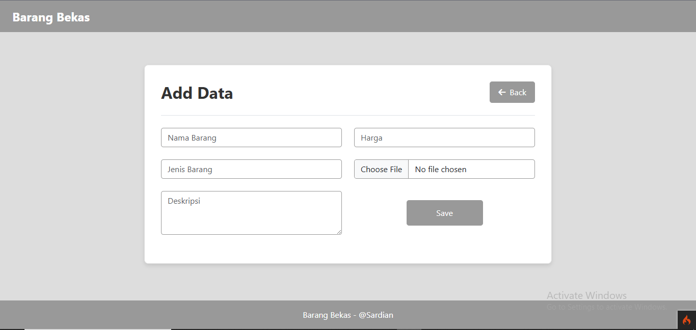

# Proyek Aplikasi Penjualan Barang Bekas

UAS Teknologi WEB

Ini adalah proyek aplikasi web sederhana "Barang Bekas" yang dibangun menggunakan framework PHP CodeIgniter 4. Aplikasi ini dirancang untuk mengelola daftar barang bekas dan memungkinkan pengguna melihat serta membeli produk melalui integrasi WhatsApp.

## Deskripsi Proyek

Proyek "Barang Bekas" adalah sebuah platform dasar untuk menampilkan produk-produk bekas. Aplikasi ini memiliki dua antarmuka utama:

1.  **Antarmuka Pengguna (User):** Menampilkan daftar barang bekas yang tersedia, lengkap dengan detail seperti nama, jenis, harga, deskripsi, dan gambar. Pengguna dapat mencari barang berdasarkan jenis atau nama, serta langsung melakukan pembelian melalui chat otomatis WhatsApp.
2.  **Antarmuka Admin:** Menyediakan fitur manajemen dasar untuk data barang, termasuk melihat, menambah, mengubah, dan menghapus data barang.

## Teknologi yang Digunakan

- **Framework:** CodeIgniter 4.4.5
- **Bahasa Pemrograman:** PHP (Disarankan PHP 7.4 ke atas atau PHP 8.0 ke atas)
- **Database:** MySQL (melalui phpMyAdmin di XAMPP)
- **Web Server:** Apache (bagian dari XAMPP)
- **CSS Framework:** Bootstrap 5.3.0 (untuk tampilan responsif dan modern)
- **Icon Library:** Font Awesome (untuk ikon)

## Fitur Utama

- **Autentikasi Admin:** Sistem login sederhana untuk admin.
- **Manajemen Data Barang (CRUD):** Admin dapat:
  - Melihat daftar barang.
  - Menambah barang baru.
  - Mengubah detail barang yang sudah ada.
  - Menghapus barang.
- **Tampilan Produk untuk Pengguna:** Menampilkan daftar barang yang tersedia untuk dilihat oleh pengguna umum.
- **Pencarian Produk:** Pengguna dan admin dapat mencari produk berdasarkan jenis atau nama barang.
- **Integrasi WhatsApp:** Tombol "Beli" pada setiap produk di sisi pengguna akan mengarahkan langsung ke WhatsApp dengan pesan otomatis yang berisi detail produk yang ingin dibeli.

## Fitur Tambahan

- **Pengelolaan Gambar Produk:** Mendukung upload gambar untuk setiap produk.
- **Hash Password Aman:** Menggunakan fungsi `password_hash()` PHP untuk keamanan password admin, bukan MD5.
- **Validasi Input:** Menggunakan fungsi `esc()` untuk mengamankan output data dan mencegah XSS.

## Cara Menjalankan Aplikasi

Ikuti langkah-langkah di bawah ini untuk menginstal dan menjalankan aplikasi:

1.  **Persiapan Lingkungan:**

    - Pastikan Anda sudah menginstal **XAMPP** di sistem Anda.
    - Pastikan Apache dan MySQL sudah aktif melalui XAMPP Control Panel.

2.  **Kloning/Unduh Proyek:**

    - Unduh atau kloning repositori proyek ini ke dalam folder `htdocs` XAMPP Anda (misalnya: `C:\xampp\htdocs\Barang Bekas`).

3.  **Konfigurasi Database:**

    - Buka **phpMyAdmin** (biasanya melalui `http://localhost/phpmyadmin/`).
    - **Buat Database dan Impor Schema:**
      - Buat database baru dengan nama `db_barang_bekas`.
      - Pilih database `db_barang_bekas` yang baru Anda buat dari sidebar kiri.
      - Klik tab **"Import"** di navigasi atas.
      - Di bagian "File to import", klik **"Choose file"** dan navigasikan ke folder proyek Anda, lalu pilih `database/db_barang_bekas.sql`.
      - Gulir ke bawah dan klik tombol **"Go"** di bagian bawah halaman untuk memulai impor.
    - Edit file `.env` di root proyek Anda (jika belum ada, salin `.env.example` menjadi `.env`) dan sesuaikan konfigurasi database:
      ```
      database.default.hostname = localhost
      database.default.database = db_barang_bekas
      database.default.username = root
      database.default.password = (kosongkan jika tidak ada password di XAMPP)
      database.default.DBDriver = MySQLi
      ```

4.  **Instalasi Dependensi (Composer):**

    - Buka terminal **Git Bash** (atau CMD), navigasikan ke folder root proyek (`Barang Bekas`).
    - Jalankan perintah berikut untuk menginstal dependensi CodeIgniter:
      ```bash
      composer install
      ```
      _Catatan: Jika Anda mengalami masalah dengan dependensi seperti `codeigniter4/tinker` atau `codeigniter4/coding-standard` yang tidak ditemukan, Anda dapat mengabaikannya untuk fungsionalitas dasar aplikasi ini karena tidak esensial untuk fungsi utama. Anda bisa mencoba `composer update` jika `composer install` gagal._

5.  **Akses Aplikasi:**

    - Di terminal **Git Bash**, pastikan Anda berada di folder root proyek (`Barang Bekas`).
    - Jalankan perintah berikut untuk memulai server pengembangan CodeIgniter:
      ```bash
      php spark serve
      ```
    - Akses aplikasi Anda melalui browser dengan URL yang ditunjukkan oleh perintah di atas, biasanya:
      `http://localhost:8080`

6.  **Login Admin:**
    - Akses halaman login admin: `http://localhost:8080/auth` (sesuaikan URL jika port berbeda)
    - Username: `admin`
    - Password: `iminf` (password plain text yang Anda hash ke database)

## Screenshot Aplikasi
- Form Utama User

- Form Login Admin

- Form Admin

- Form Edit Data

- Form Add Data

